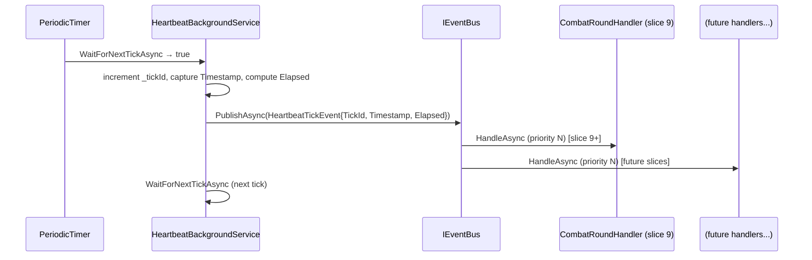

# Time System (Heartbeat) — Phase 3 slice 9-b

## Status

`planned`

## Actors

- **System** — `HeartbeatBackgroundService` (Initiator; drives the tick on a background `PeriodicTimer`)
- **System** — any future handler that subscribes to `HeartbeatTickEvent` (combat round processor, mob AI ticker, effect expiry checker)

## Module

`Core/Modules/Time/` (new module)

## Description

A minimal heartbeat infrastructure that publishes `HeartbeatTickEvent` at a configurable interval. This is the shared clock that combat rounds (slice 9), mob AI ticks (slice 11+), and future effect-expiry tracking will all subscribe to. The slice ships only the heartbeat itself — no named timers, no per-entity cooldowns, no effect expiry. Subscribers attach to the event bus independently; the heartbeat is model-agnostic.

## Preconditions

- The generic host is running with the DI container fully built (all handlers subscribed before the first tick fires — existing startup ordering guarantee).
- `appsettings.json` may or may not supply `Heartbeat:IntervalMs`; absence means the default of 2000 ms applies.

## Postconditions

- `HeartbeatBackgroundService` is running a `PeriodicTimer` at the configured interval.
- On each tick, `HeartbeatTickEvent { TickId, Timestamp, Elapsed }` is published to `IEventBus`.
- Any handler subscribed to `HeartbeatTickEvent` (e.g. the combat round handler in slice 9) receives the event and executes its logic.
- The service stops cleanly when the host shutdown `CancellationToken` fires; the in-flight tick (if any) completes normally.

## Main flow

1. **Host startup.** `HeartbeatBackgroundService.StartAsync` is called by the .NET generic host. The service is registered last (after `PersistenceBootstrap`, `WorldContentBootstrap`, `PersistenceFlushTimer`, and `TelnetServer`) so the first tick cannot land on a half-built world. Assumption: `HeartbeatBackgroundService` is added to the DI service collection after `TelnetServer` in `Server/Program.cs` so it starts after the listener is open and the world is fully seeded.
2. **Tick loop begins.** `ExecuteAsync` creates a `PeriodicTimer` with period read from `IConfiguration["Heartbeat:IntervalMs"]` (default 2000). The timer's `WaitForNextTickAsync` awaits the first tick.
3. **Tick fires.** `HeartbeatBackgroundService` increments its internal `long _tickId` counter, captures `DateTimeOffset.UtcNow` as `Timestamp`, and computes `Elapsed = Timestamp - _lastTimestamp` (initialized to `StartedAt` so tick 1 has an accurate elapsed). This is purely mechanical bookkeeping — no game logic.
4. **Event published.** The service calls `IEventBus.PublishAsync(new HeartbeatTickEvent { TickId, Timestamp, Elapsed })`. This is the only cross-thread operation: a background thread publishing to the event bus. The Phase 4 thread-safety review will evaluate the event bus under concurrent ticks; acknowledged here.
5. **Handlers execute.** The event bus dispatches `HeartbeatTickEvent` to all subscribed handlers in priority order. In slice 9, `CombatRoundHandler` is the first subscriber; future slices add further handlers. Each handler does its own work (e.g. query `CombatStateComponent` entities, call `ICombatSystem.ExecuteRound`). None of this logic lives in `HeartbeatBackgroundService`.
6. **Loop continues.** Control returns to `WaitForNextTickAsync`. The next tick is scheduled relative to the timer's period, not relative to when handler execution completed — `PeriodicTimer` does not drift on handler overrun. A handler overrun that exceeds the tick period causes the next tick to fire immediately after the current one completes (standard `PeriodicTimer` behavior).
7. **Shutdown.** When the host sends the `CancellationToken`, `WaitForNextTickAsync` returns `false` and `ExecuteAsync` exits normally. The `BackgroundService` base class calls `StopAsync`, which awaits the task. No cleanup is needed — no registered subscribers, no timers to cancel beyond the `PeriodicTimer` lifetime.

## Events fired

| Event | Publisher | Payload | Notes |
|---|---|---|---|
| `HeartbeatTickEvent` | `HeartbeatBackgroundService` | `long TickId`, `DateTimeOffset Timestamp`, `TimeSpan Elapsed` | Published on every tick; past-tense thin fact (INV-6). `TickId` is a monotonically increasing counter starting at 1. |

No events are published on startup or shutdown — the tick loop produces all events.

## Systems / handlers involved

| Piece | New / Reuse | Notes |
|---|---|---|
| `HeartbeatBackgroundService` (`Server/`) | New | Initiator; `BackgroundService`; owns `PeriodicTimer`, reads `IConfiguration`, publishes `HeartbeatTickEvent`. Not a domain system — no return values, no game logic (INV-5, INV-8). |
| `IHeartbeatService` | New | Minimal interface for `HeartbeatBackgroundService`. See Design notes for why this is intentionally thin (may be absent entirely). |
| `HeartbeatTickEvent` | New | In `Core/Modules/Time/Events/HeartbeatTickEvent.cs`. Thin past-tense payload. |
| `TimeModule` | New | `Core/Modules/Time/TimeModule.cs`; exposes `AddTimeModule(IServiceCollection)`. Registers `HeartbeatBackgroundService` as a `BackgroundService` (via `AddHostedService`). Called from `Server/Program.cs`. |
| `IEventBus` | Reuse | Existing cross-cutting bus; `HeartbeatBackgroundService` injects it directly (no domain system intermediary). |

No domain system is needed — the heartbeat is pure infrastructure. No handler is introduced in this slice; the first handler (`CombatRoundHandler`) lands in slice 9.

## Content tooling impact

None. This slice adds no gameplay state, no authored content, no YAML schemas, no admin commands, no `TemplateRegistry` entries. The only authoring surface is the `Heartbeat:IntervalMs` key in `appsettings.json`, which is Category 1 operational configuration (see `docs/architecture/05-configuration.md`). Justification for "none": the heartbeat is pure infrastructure; it publishes a tick event and nothing else. Any gameplay state gated on the heartbeat belongs to the slice that introduces it.

## Cross-cutting surfaces stressed

### Commands
**Adequate.** No new commands. The heartbeat is not player-visible in this slice. No admin command to change the interval is introduced (deferred; if needed, it is a slice 9 or later concern).

### Output
**Adequate.** No output in this slice. `HeartbeatBackgroundService` does not write to any session.

### Persistence
**Adequate.** No entities are created. No components are introduced. No persistence calls are made. The heartbeat has no persistent state.

Persistence opt-in audit (mandatory sub-check):
- **No entities:** `HeartbeatBackgroundService` creates no entities. `PersistentEntity` is irrelevant.
- **No components:** `HeartbeatTickEvent` is an event record, not a component. No `[Persistent]` decisions are needed.
- **Level 3 / 4 not applicable:** No `SpawnMissingEntities` path, no `LocationComponent` placement.

### Event bus
**Adequate.** `IEventBus.PublishAsync` is called from a background thread (`PeriodicTimer` callback). This is the **same cross-thread pattern already used by every `BackgroundService` in the codebase** (`PersistenceFlushTimer` already calls persistence methods from a background thread; `WorldContentBootstrap` fires `WorldContentReadyEvent` from its `StartAsync`). However, the event bus has not been explicitly reviewed for concurrent publish from multiple background threads at the same time. Classification: **Acknowledged debt.** The Phase 4 thread-safety review (`backlog.md`) already tracks this. Since `HeartbeatBackgroundService` has a single `PeriodicTimer` and does not publish concurrently with itself, and the existing services already cross the thread boundary once on startup, no new concurrency shape is introduced by this slice. The thread-safety review is the appropriate venue.

### ECS queries
**Adequate.** `HeartbeatBackgroundService` makes no ECS queries. Future handlers (combat, AI) will query ECS; that is their concern.

### Broadcast
**Adequate.** No broadcast in this slice.

### Time
**Gap exposed (this slice IS the time surface).** `HeartbeatBackgroundService` is the time framework. It defines the canonical shared clock via `HeartbeatTickEvent`. Any future "named timer" or "per-entity cooldown" is a subscriber to this event. The slice ships the framework before any consumer; no hand-rolled pattern is needed downstream. INV-19 satisfied: the framework lands with this slice.

### Content templates
**Adequate.** No templates introduced.

### Configuration
**Adequate.** `Heartbeat:IntervalMs` is a Category 1 operational key read from `IConfiguration` via the existing DI-provided `IConfiguration` instance. This follows the established pattern from `Persistence:FlushIntervalSeconds` and `Server:Port` (see `docs/architecture/05-configuration.md`). No new infrastructure needed.

### Sessions
**Adequate.** `HeartbeatBackgroundService` does not interact with `ISessionManager` or any session directly.

### Modules
**Adequate.** `TimeModule` follows the existing module pattern (`AddXModule(IServiceCollection)`), matching `AddItemModule`, `AddMobModule`, etc. No new infrastructure.

## Flows introduced or modified

### New: Flow 16 — Heartbeat tick

**Introduced by this slice.** Must be added to `docs/architecture/flows/README.md` in the same PR.

**Trigger.** `PeriodicTimer` fires in `HeartbeatBackgroundService.ExecuteAsync`.



**Steps.**

1. `PeriodicTimer.WaitForNextTickAsync` returns `true` (or `false` on cancellation → exit).
2. `HeartbeatBackgroundService` increments `_tickId`, captures `DateTimeOffset.UtcNow`, computes `Elapsed = now - _lastTimestamp`, updates `_lastTimestamp = now`.
3. Publishes `HeartbeatTickEvent { TickId, Timestamp, Elapsed }` via `IEventBus.PublishAsync`.
4. Event bus dispatches to all subscribed handlers in priority order. In this slice, no handlers are registered; the first registers in slice 9.
5. Loop returns to `WaitForNextTickAsync`.

**Cross-references.**
- `Core/Modules/Time/Events/HeartbeatTickEvent.cs`
- `Server/HeartbeatBackgroundService.cs` (or `Core/Modules/Time/HeartbeatBackgroundService.cs` — see Design notes)
- `docs/architecture/flows/README.md` — add to index as Flow 16.

### Modified: Flow 1 — Server startup

The `HeartbeatBackgroundService` is added as the last hosted service, after `TelnetServer`. The startup mermaid diagram and step 1 (DI registration) must be updated to include `HeartbeatBackgroundService` in the hosted-service queue.

## Design notes

### `IHeartbeatService` interface — minimal or absent

The original prompt specifies `IHeartbeatService` with `Start()` / `Stop()` lifecycle methods. In practice, `BackgroundService.StartAsync` / `StopAsync` are called by the .NET host automatically — callers do not need to invoke `Start`/`Stop` directly. There are no in-game subscribers to a registry; subscribers use `IEventBus` directly. Therefore `IHeartbeatService` may be empty (a marker interface) or absent entirely. **Recommendation:** omit it unless a concrete caller other than the host needs to reference the heartbeat by interface. If needed for testability (mocking the heartbeat in unit tests), it can be introduced alongside the test framework (Phase 4). This is an open question for the implementation — see Open questions.

### Background service placement: `Server/` vs. `Core/`

`BackgroundService` is a .NET hosting abstraction (`Microsoft.Extensions.Hosting`), which belongs at the server/host layer. `HeartbeatBackgroundService` lives in `Server/` (analogous to `PersistenceFlushTimer`, `WorldContentBootstrap`, `TelnetServer`). `HeartbeatTickEvent` lives in `Core/Modules/Time/Events/` so handlers anywhere in `Core` can subscribe without a `Server/` dependency. `TimeModule` is split: the event + interface (if any) are in `Core/`; the hosted service registration is in `Server/Program.cs`.

### Multiple combat model support

`HeartbeatBackgroundService` is combat-model-agnostic. It publishes a tick; the combat handler subscribes. Switching from autocombat (background timer drives rounds) to freeform (player input drives rounds) means the combat handler un-subscribes or is not registered — the heartbeat continues for effect expiry, mob AI, and other consumers. No change to this slice is required when the combat model changes.

### Per-entity cooldown tracking (future)

An `ICooldownSystem` (future) would subscribe to `HeartbeatTickEvent`, query entities with a `CooldownComponent`, decrement counters, and publish `CooldownExpiredEvent`. Not in scope for this slice. The heartbeat event payload is intentionally minimal — `ICooldownSystem` derives all timing from `Elapsed` and `Timestamp`.

### Named timers (future)

Respawn timers, buff expiry, shop restocking — all would subscribe to `HeartbeatTickEvent` and maintain their own state (timestamps, countdown values). They do not need a separate timer abstraction; they consume the shared clock and handle their own expiry logic.

### Thread safety acknowledgment

`HeartbeatBackgroundService.ExecuteAsync` runs on a background thread managed by the .NET host. `IEventBus.PublishAsync` is called from that thread. This is acknowledged debt consistent with the Phase 4 thread-safety review entry in `backlog.md`. The single-threaded `PeriodicTimer` pattern means the heartbeat does not publish concurrently with itself; risk is from overlap with other background services, which is the same risk already present (e.g. `PersistenceFlushTimer`). No new concurrency shape.

### Startup ordering constraint

`HeartbeatBackgroundService` must be registered **after** `TelnetServer` in `Server/Program.cs`. This ensures the first tick cannot fire before the world is fully seeded and the listener is open. The host runs `StartAsync` to completion for each service in registration order; this is an existing guarantee, not a new mechanism.

### `TickId` starts at 1

`_tickId` is initialized to 0 and incremented before publishing, so the first event carries `TickId = 1`. This makes `TickId = 0` an unambiguous sentinel for "no tick has fired yet."

### `Elapsed` on the first tick

`_lastTimestamp` is set to `DateTimeOffset.UtcNow` in `ExecuteAsync` before the loop (i.e., at service start time). The first tick's `Elapsed` is approximately equal to `IntervalMs` — accurate enough for effect expiry and combat round pacing; combat does not need sub-millisecond precision on the first tick.

## Reference catalog updates (in-flight only)

### New: `HeartbeatTickEvent` (`Core/Modules/Time/Events/HeartbeatTickEvent.cs`)

```
public sealed record HeartbeatTickEvent
{
    public long TickId { get; init; }
    public DateTimeOffset Timestamp { get; init; }
    public TimeSpan Elapsed { get; init; }
}
```

Not a component. Not persisted. Past-tense thin fact (INV-6).

### New module: `TimeModule`

`Core/Modules/Time/TimeModule.cs` — exposes `AddTimeModule(IServiceCollection)`. Registers:
- `HeartbeatTickEvent` (no registration needed — it's an event record)
- *(Optional)* `IHeartbeatService` → `HeartbeatBackgroundService` if the interface is retained

`Server/Program.cs` — calls `services.AddTimeModule()` and adds `HeartbeatBackgroundService` via `services.AddHostedService<HeartbeatBackgroundService>()`.

### `docs/reference/handlers.md` — no change in this slice

No handler is introduced. The combat round handler (slice 9) will add the first `HeartbeatTickEvent` subscriber.

### `docs/architecture/flows/README.md`

Add Flow 16 to the index table and the flow body (see Flows section above).

Update Flow 1 (Server startup) to include `HeartbeatBackgroundService` in the hosted-service queue.

## Open questions

1. **`IHeartbeatService` interface.** Should it exist? If the only consumer is the host's `BackgroundService` lifecycle, the interface is noise. Recommended: omit unless a test-double use case is demonstrated. Decide before implementation begins.

2. **Startup ordering — is "after `TelnetServer`" the right gate?** The intent is "after the world is fully seeded." `TelnetServer.StartAsync` opens the TCP listener, which is the last step of world assembly (Flow 1). Placing `HeartbeatBackgroundService` after `TelnetServer` achieves this. Confirm this registration order is enforced in `Server/Program.cs` and does not conflict with any other hosted-service ordering constraint introduced by slices 9-a or 9-c.

3. **`PeriodicTimer` overrun behavior.** If a handler subscribed to `HeartbeatTickEvent` takes longer than `IntervalMs`, the next tick fires immediately after the current one completes (standard `PeriodicTimer` semantics). This is acceptable for the MVP autocombat model but may require a backpressure mechanism if tick handlers become expensive. Acknowledged for Phase 4 hardening; no action in this slice.

4. **`IEventBus.PublishAsync` — is it `async` or sync?** The current `IEventBus` shape (verify in code) should clarify whether `PublishAsync` is truly awaited by the caller or fire-and-forget. `HeartbeatBackgroundService` should `await _eventBus.PublishAsync(...)` so handler exceptions surface in the background service's error handling rather than being silently swallowed. Confirm the event bus implementation supports this.

## Related

- [`combat.md`](combat.md) — slice 9 (blocked on this slice); first consumer of `HeartbeatTickEvent`
- [`entity-state-management.md`](entity-state-management.md) — slice 9-a (parallel prerequisite)
- [`stat-system.md`](stat-system.md) — slice 9-c (parallel prerequisite)
- [`attributes.md`](attributes.md) — slice 8a; establishes `PoolsComponent` that combat reads
- [`mobs.md`](mobs.md) — slice 8; mob AI future consumers will subscribe to `HeartbeatTickEvent`
- [`persistence-substrate.md`](persistence-substrate.md) — `PersistenceFlushTimer` is the existing `PeriodicTimer`-based `BackgroundService` this slice mirrors
- [`docs/roadmap/backlog.md`](../roadmap/backlog.md) — thread-safety review entry covers the event bus under concurrent ticks
